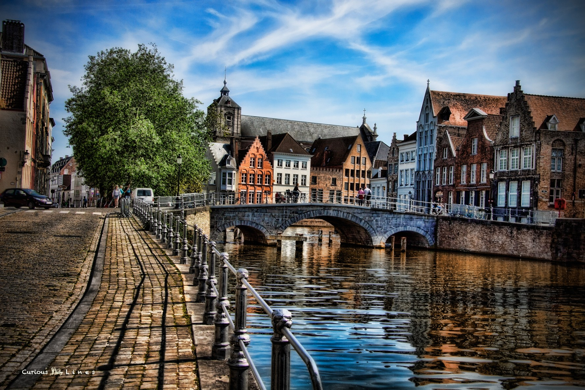
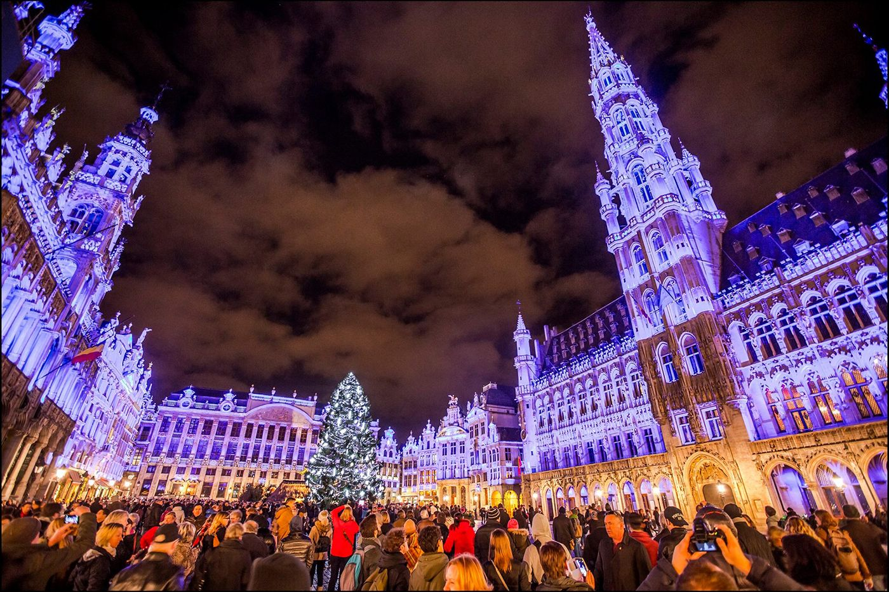

<h1><strong>Chers lecteurs,</strong></h1>

Ça y est, je suis enfin de retour chez moi après un voyage incroyable en Belgique ! Je suis tellement enthousiasmé de partager avec vous les endroits touristiques les plus intéressants que j'ai visités lors de ce voyage mémorable. La Belgique est un pays enchanteur avec plein de paysages pittoresques et de délices culinaires.
{style="text-align: justify;"}

<h2><strong>Voici les "highlights" de mon aventure belge...</strong></h2>

<h3><strong>Bruges, la Venise du Nord</strong></h3>

Commençons par la magnifique ville de Bruges, surnommée la <strong>"Venise du Nord"</strong>. Cette charmante cité médiévale est célèbre pour ses canaux romantiques qui serpentent entre les bâtiments historiques. Saviez-vous que Bruges était autrefois l'un des ports les plus importants d'Europe au Moyen Âge ? Son centre-ville préservé est inscrit au patrimoine mondial de l'UNESCO et profite de sites historiques, tels que la majestueuse église <strong>Notre-Dame et le Béguinage</strong>, un ensemble de maisons traditionnelles entourées d'un jardin paisible.
{style="text-align: justify;"}

<i>C'était très beau par là... </i>

<h3><strong>Bruxelles, le cœur de la Belgique</strong></h3>

Ensuite, j'ai eu la chance de visiter la ville dynamique de <strong>Bruxelles</strong>, la capitale de la Belgique. <strong>La Grand-Place de Bruxelles</strong> est une véritable merveille architecturale, avec ses bâtiments ornés datant du XVIIe siècle. Aujourd'hui, elle est le théâtre de nombreux événements culturels et de célébrations, notamment le <strong>célèbre marché de Noël en hiver</strong>. Ne manquez pas non plus de goûter aux délicieuses gaufres belges et aux moules-frites, des spécialités culinaires incontournables de la Belgique ;)
{style="text-align: justify;"}

<i>Je ne peux pas attendre à Noël pour visiter le marché ! </i>

<h3><strong>Des recommendations turistiques</strong></h3>

Maintenant, passons à mes recommandations pour les futurs touristes qui souhaitent visiter la Belgique. Voici quelques conseils utiles :
{style="text-align: justify;"}

<ul class = "list">

<li><a><strong>Explorez les villes principales</strong>, comme Bruxelles, Bruges, Anvers et Gand, pour découvrir leur riche histoire et leur architecture remarquable.</a></li>

<li><a>a</a></li>

<li><a><strong>Prévoyez du temps pour découvrir les paysages naturels</strong>, tels que les Ardennes belges, avec leurs sentiers de randonnée magnifiques.</a></li>

<li><a>a</a></li>

<li><a><strong>Profitez des nombreux festivals et événements culturels</strong> organisés tout au long de l'année, tels que la fête du Carnaval de Binche ou les célébrations de la Fête de la Bande Dessinée à Bruxelles.</a></li>

</ul>

J'espère que ce blog vous a donné un aperçu de mes aventures en Belgique et qu'il vous a inspiré à découvrir ce merveilleux pays par vous-même. N'hésitez pas à laisser vos commentaires et à partager vos propres expériences de voyage en Belgique. Au plaisir de vous lire !
{style="text-align: justify;"}

À bientôt,

- César

 

<i>Je tiens à souligner que l'article que vous venez de lire est purement fictif et représente uniquement un exercice pratique de la langue française. La intention de cet article était de vous offrir une immersion dans la Belgique tout en pratiquant cette belle langue.</i>

