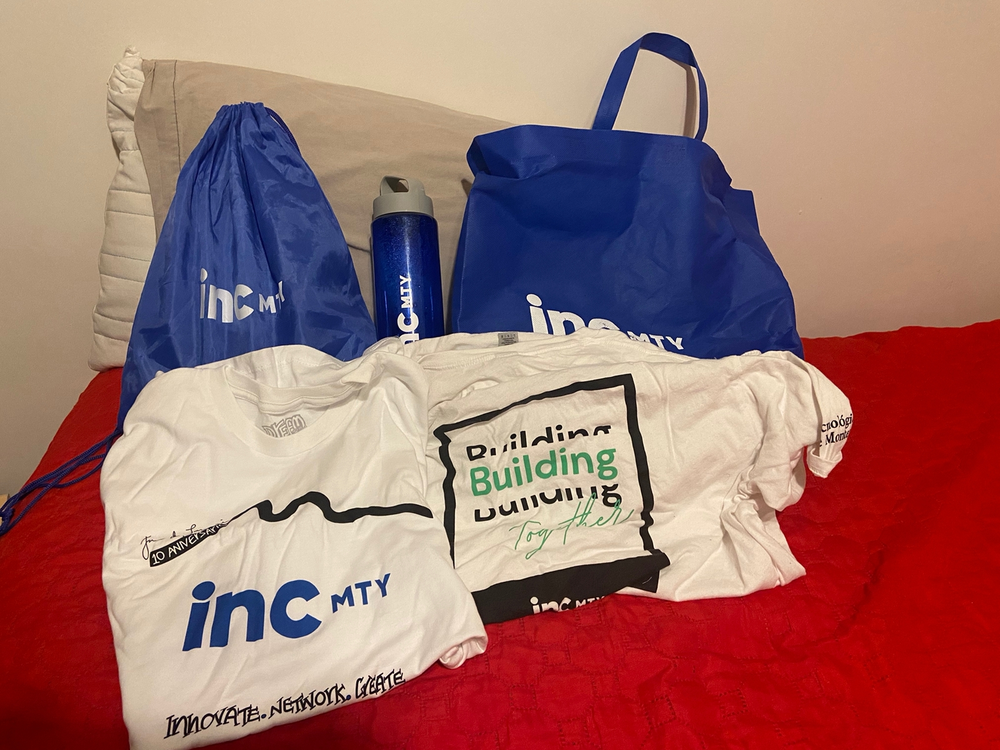
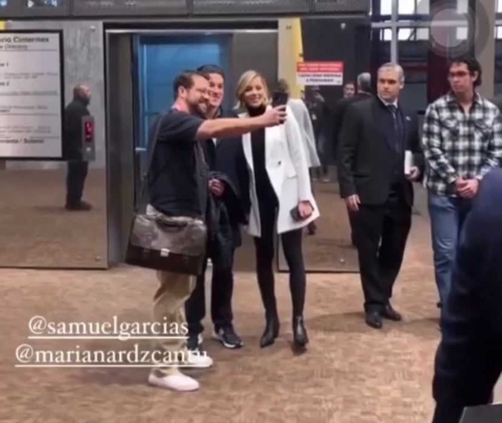

Up until last year, I completely ignored Instagram and social media ads in general. I found them repetitive, boring, and mostly pointless since I’ve almost never been in their targeted markets. That was until 2022 came by and a couple of ads got me into certain events that completely changed the game for me. The first one came in February for a Tony Robbins free online seminar (that was actually a YouTube ad, how ironic). The second one came in October, a chance to become a staff member for the 10th annual incMTY entrepreneurship festival. What you’re about to read is how I went from not even remembering that this event existed to quite literally doing some networking with a couple of Japanese executive board members, and all of that at absolutely no monetary cost whatsoever. 
{style="text-align: justify;"}

 

<h2><strong>Ok, so how did you get in?</strong></h2>

As previously foreshadowed, I was going through Instagram stories when suddenly a bright neon blue ad came up. It was an invitation to become an official incMTY staff member. I stopped scrolling for a moment. I had attended Blockchain Land about a month prior to that  as a staff member as well (I’ll write about that story soon), so I kind of knew what to expect from this type of event. After giving it a thought and checking my agenda, I said “why not”. I should note that I was already all-in for these types of socializing events at this point in the semester, so adding one more to my personal record was the only possibly correct answer.
{style="text-align: justify;"}

Fast forward a couple of weeks and I was attending a general bootcamp session at Uni’s
main administrative building (I still remember the annoyance when trying to fit all the official merch I received in my backpack after signing the event waivers). I learned at the event that I was part of the “ambassadors” team which was essentially in charge of lifting the mood when necessary and giving directions to the lost participants who bought tickets to attend the event. Did I already mention that tickets ranged from 2,000 to 20,000 MXN for this three-day thing and that I was being given access for free just by becoming a staff member?  
{style="text-align: justify;"}

  

<i>The official merch in question. I should have better folded the T-shirts :(</i>

 

<h2><strong>Alright, that’s nice, I guess. So what did you do at the event?</strong></h2>

Since I still don’t own a car for myself, I had to arrive everyday to Uni before 7 AM to take the sponsored bus and get to the event venue. Funny enough, every morning felt like Groundhog Day with the same staff members in white T-shirts (our official uniform for the next 72 hours) and a couple of staff Directors in black running around to prepare the morning shift. I honestly took things slowly, sat down on a couch at the office we were working from, and enjoyed breakfast courtesy of the venue’s administration. Now, don’t think I was all laid-back the whole event; I stopped eating the moment some colleague or higher-up asked me for my help. But hey, I need my breakfast to function properly during morning hours.
My role didn’t give me any direct tasks throughout the event, so I was thinking, “well, if I’m not forced to be somewhere in particular, I might as well go explore everywhere”. That’s when I overheard some staff people discussing about two Japanese executives representing <strong><a href = "https://www.daikin.co.jp/" target = "_self">Daikin</a></strong> (Japanese air conditioning company) at the event who needed one-to-one linguistic assistance. Long story short, I became these guys’ personal pseudo-translator (OK, at least there was an attempt) the entire first day while walking them around the venue. I must confess I couldn’t hide my excitement when Fukutoku-san offered me his presentation card before leaving. That should be enough to qualify for a Japanese passport. Arigatou gozaimashita, <strong>Fukutoku-san</strong>, <strong>Natsume-san</strong>. 
{style="text-align: justify;"}

We’re now on the second day and I had just finished having breakfast at the staff’s office. I talked for a bit with Natsume-san about Japanese universities and culture in general. I even told him about my Economics career choice and he seemed happy about it. Then I presented a couple of conferences in some side stages at the venue, and… that was basically it, not much went on that day.
{style="text-align: justify;"}

Finally the third day arrived, the last turn to bat. And boy, was that destined to be a special one. It started by going to the second floor to check on a conversation between a major book author <strong>(James Clear, "Atomic Habits")</strong> and Tec’s rector for undergraduate and postgraduate programs, <strong>Juan Pablo Murra</strong>. The interesting part about this was finding lots of other Tec’s higher-ups already inside the conference venue. Among them, <strong>Dr. Mario Adrián Flores</strong>. After a nice quick chat, he said he was leaving to receive the state governor, <strong>Samuel García</strong>, at the event’s venue entrance. Well, a few minutes later I was right besides him and Nuevo León’s Secretary of Economy <strong>Iván Rivas</strong> as some sort of Uni’s ambassador. We greeted him and his wife, walked them inside the venue, end of the fairytale. I wished I had worn a more appropriate attire that day, but oh well. I wasn’t even meant to do any of this in the first place. 
{style="text-align: justify;"}

 

<i>That's your boy right there in a wool, B&W sweater right besides Secretary Rivas. </i>

 

<h2><strong>Wait, so did you break the rules?</strong></h2>

I wouldn’t say so. Again, at no point was I officially out of my place, since my job was to just go around the venue and cheer up people. I also believe there are opportunities in life that you simply cannot let them escape. Talking to Japanese executives? Meeting the Governor just because? Sometimes you’ve got to ignore the script and trace your own path. Back in high school one of my two French teachers told me that <strong>if I want to do “xyz”, the only requisite to do so is to accept the consequences from worst case scenario “abc”.</strong> What’s the worst that they could have done to me at the event, shout “hey, back off”? Sure thing, for such a chance, I’ll take the scolding any day.
{style="text-align: justify;"}

 

<h2><strong>Any major learnings?</strong></h2>

Yes, two in particular. I was used to feeling helpless for not having any entrepreneurship project to talk about with other people. However, I then realized that hearing and learning from said people’s experiences is just as useful as exchanging phone numbers; networking is also about that. The other thing I absolutely confirmed here is that <strong>SHYNESS SCARES AWAY WAY TOO MANY OPPORTUNITIES IN LIFE</strong>. Think about how many chances you’ve let go because you did feel like “bothering that person” or perhaps because you felt that they were too intimidating. I’ve got something for y’all: they’re just like us, human beings. Don’t let your head overthink it: send that message, ask for that opportunity, tap that person’s shoulder at the conference. You never know when they could be ready to listen to whatever you’ve got to tell them.  
{style="text-align: justify;"}

 

<h2><strong>What’s your final take on the event?</strong></h2>

<strong>incMTY:</strong> an entrepreneurship event where I got a free pass to a three-day 2,000+ MXN event, made tons of new friends, learnt from highly-knowledgeable people, ate 2 out of 3 daily meals for free, and got a bit away from routine, which I most definitely needed to. 10/10 would definitely recommend ;)
{style="text-align: justify;"}
