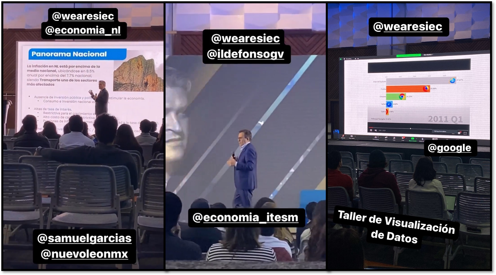

Have you ever signed up to a role at some place, literally do stuff from all other roles available and end up like, “Damn, and I was just supposed to deliver drinks to the guests”? You’d be surprised that this is actually what goes down in most volunteer-based events. Even as an average Marketing staff member, unwritten <strong>Volunteer Commandment #1</strong> states <strong>“Thou shalt cover thy fellow colleague’s butt who just screwed up with the cash register and needs backup”</strong>. It’s just like that, but trust me, it ends up being fun (at least most of the time). Now, allow me now to talk to you about that time I signed up to be a secondary staff member and ended up becoming the literal <strong>Logistics Director</strong> from the most important event of my study field at Uni.
{style="text-align: justify;"}

 

<h2><strong>Oh, c’mon, you must be exaggerating…</strong></h2>

I’m not, I swear, but let me start from the top. It’s mid-August, and the semester started two weeks ago. Oh dear, homework’s piling up (not really) and I’m already at my mental limit (ok, maybe that’s an overstatement). I remember I was at the time looking for some student events that allowed me to meet other Economics students at Campus. My prayers were then answered when I came across an application form to become a staff member for the <strong>41st International Economics Symposium</strong> (AKA "SIEC"). Quite convenient, innit? I filled out the online document placing <strong>“Logistics”</strong> as my first option. While doing so, I was praying in my head for things to go decent and to not end up humiliated a second time. “Not in Uni”, I said to myself.
{style="text-align: justify;"}

After a couple weeks of the waiting game, I was added to a Whatsapp group and given a Zoom link to a meeting where I was assigned my first tasks as a brand new Logistics staff member. Just look at him, how charmful and courageous of a 19-year-old fella <strong>(/s, everybody)</strong>. Anyways, we were now in September and I was in the middle of a phone streak; about 10 to 15 daily calls to businesses asking them for their prices, writing down whatever they said and moving on to the next one on the list. “Things are looking good”, I thought (at least for me, considering that was my only assigned task). Then, something happened. One day I was working for SIEC, but by the next one I was also… supporting someone’s campaign to become <strong>PRESIDENT</strong> of the Economics B.S.’s Students Committee?
{style="text-align: justify;"}

<i>My Google Sheets with the businesses's info looked something like this. Not showing you the real one for obvious doxxing reasons, duh.</i>

 

<h2><strong>Well, surely you were not simply dragged out of your bed for that one…
</strong></h2>

Indeed, I was not. I was formally invited by this pristine young man to become part of his campaign (as formal as a phone call can get, that is). Honestly, things just zoomed by during the following 2 weeks. To keep matters brief since this is not the post’s main point, after endless team meetings, brainstorming sessions, a 2-hour debate between the candidates in question, and a 7-hour last-day sort of propaganda session… we did not win. It was finally October, which meant only 30 days left before the 3-day event started. <strong>Good thing I’m the only knucklehead who’s doing this while also working for SIEC, right?</strong>
{style="text-align: justify;"}

<i>Not me in the picture, but that was our campaign right there. Yes, pizza tasted good as per usual.</i>

 

<h2><strong>Two’s a company, three’s a crowd, seven must be a joke…
</strong></h2>

Or so you might think after you learn that <strong>everyone at that campaign, including our own presidential candidate, too, were all SIEC staff members.</strong> And now, we were about two weeks away from Day 1 while there were still quite a few pending things on the agenda. Oh dear, here we go.
{style="text-align: justify;"}

Quick disclaimer here, I’m not trying to blame anyone for this. I know it was no one’s fault that this “presidential run” happened right during SIEC’s preparation period. Regardless, this is when my multitasking facet started to arise (I mean, it kinda had to, we were behind schedule). On top of my daily business calls, I was now contacting Tec higher-ups to be allowed to use Uni’s furniture at the event, make reservations for some parking lot spaces for the speakers who would be participating, among other tedious logistics tasks. Aaaaand, in addition to all of that, I was told by SIEC’s General Director (the aforementioned presidential prospect) about three days prior to the event that I would be organizing the <strong>Zoom webinars</strong> for those who were attending the conferences online. If I’m absolutely honest, it wasn’t really that hard of a software to manage. What annoyed me slightly was the time frame I was given to deal with something of such magnitude. It was around this time, however, that some staff member sent an email where she referred to me as the <strong>“Logistics Director”</strong>. I was certainly confused, but since nobody really went against it, I proudly placed said title at the end of every single related email I sent from there on. How narcissistic, you may think, that only now was I feeling humbled to be assigned these tasks. I’ll simply say this: I was (perhaps accidentally) promoted from regular staff member to Director within two months. That was something I surely was going to feel proud about. 
{style="text-align: justify;"}

So, the day finally arrived. Day 1/3 and everything was (allegedly) all set: attendees’ food, film crew, microphones, chairs, and screens. In spite of the difficulties, we managed to (allegedly) get everything we needed to start the event. I was genuinely amazed at how it seemed that we were, in fact, winning. First couple of conferences went by and everyone seemed satisfied with the symposium’s content. Seriously, everything was going uphill. “This is it”, I thought, for I was finally part of an organizing committee <strong>and I was not screwing things up.</strong> 
{style="text-align: justify;"}

But then, two hours prior to finishing Day 1, Mr. General Director asked me to look carefully at the film crew, <strong>because the next day I was about to do their job all by myself due to unexpected budgeting circumstances.</strong>
{style="text-align: justify;"}

 

Shit.

<i>That's the face of someone who's just being told to learn how to play camera man and producer by yesterday (and has no prior knowledge about it).</i>

 

<h2><strong>Huh, that’s sad. Anyways, keep going.</strong></h2>

To be fair, things could have been worse: I could have been told about this five minutes before going to bed. As soon as the last conference finished and everyone was left, I rushed to the Library, sat down in an individual cubicle and started Googling about quick audiovisual management solutions. It took me about 2 hours or so, but I figured it out in the end <strong>(shoutout to OBS and Iriun Webcam for existing and for being free)</strong> . We would just have to solve a couple of Wi-Fi issues in the morning, but right there and then, I couldn’t care less about it. I’d successfully created my own film set-up with two iPhones as main cameras and my Dell laptop as the command center. Safe to say, <strong>things were about to get hot the next day</strong> (literally, next time your hands are cold just run OBS, Zoom and 10 web tabs simultaneously and touch your device. You’re welcome, fellow European friends).
{style="text-align: justify;"}

 

<embed src="OBS.mp4" width="635" height="350" ></embed>

<i>Despite the very poor video quality, huge thanks to the kind girl who lent me her phone to film this clip as a proof of my solution.</i>

 

“Here goes nothing” was what I whispered to myself when the first speaker began his presentation the second morning. Fortunately, the filming seemed to be in progress and the online attendees were all enjoying the event, too. <strong>“Wow, so this is in fact working”</strong>, I kept thinking while the second and third conferences took place. In hindsight, this not-so-insignificant logistics adjustment was at no point as bad as it first looked like. I guess it was more of an initial shock than anything else, but that was about it. The only thing I do regret from the experience was not being able to enjoy any of these conferences live. Oh well, I knew I could just watch the replay at a later time (haven’t done it to this date, but I promise I will this winter).
{style="text-align: justify;"}

<i>Perhaps I could even get a part-time job by doing this more often, wouldn't you agree? </i>

 

When the third and final day arrived, I was much more relaxed knowing that the actual film crew was back. Now I would be able to enjoy some of the content that was being delivered to the attendees. I also got to taste some of the sponsored food and boy, did it taste more than just nice. It should be noted that we did have world-class speakers throughout the three days, including World Bank’s Vice President <strong>Jorge Familiar</strong>, INEGI’s president <strong>Gabriela Márquez</strong>, and Mexican Congressman <strong>Ildefonso Guajardo</strong>. Pretty good experience, overall.
{style="text-align: justify;"}

<i>To think that I had only seen this people before through a screen, shaking their hand the first time felt certainly intimidating. </i>

 

<h2><strong>Any final thoughts about the matter?</strong></h2>

Besides the evident political and economic knowledge I gained from the International Economics Symposium, this whole experience made me reflect about something at a much deeper, personal level. You know, sometimes you’ll find yourselves in some circumstance that you weren’t even supposed to be in in the first place, but I’ve come to realize that <strong>life is about taking those unexpected chances</strong>. I say this because I used to take the easy way out from such opportunities, but I got tired of regretting not taking them at a later time. While throwing yourself head first in life from time to time is effectively scary at first, that’s what it takes to reach the next level, don't you think? Just bring a helmet in case you get thrown too hard. Safety first.  
{style="text-align: justify;"}

Huge thanks to all speakers, my dear organizing committee friends, attendees, and really everyone who made the 41st SIEC possible. Hope to see you guys at the 42nd edition ;) 
{style="text-align: justify;"}

<i>Well done, everyone!</i>

